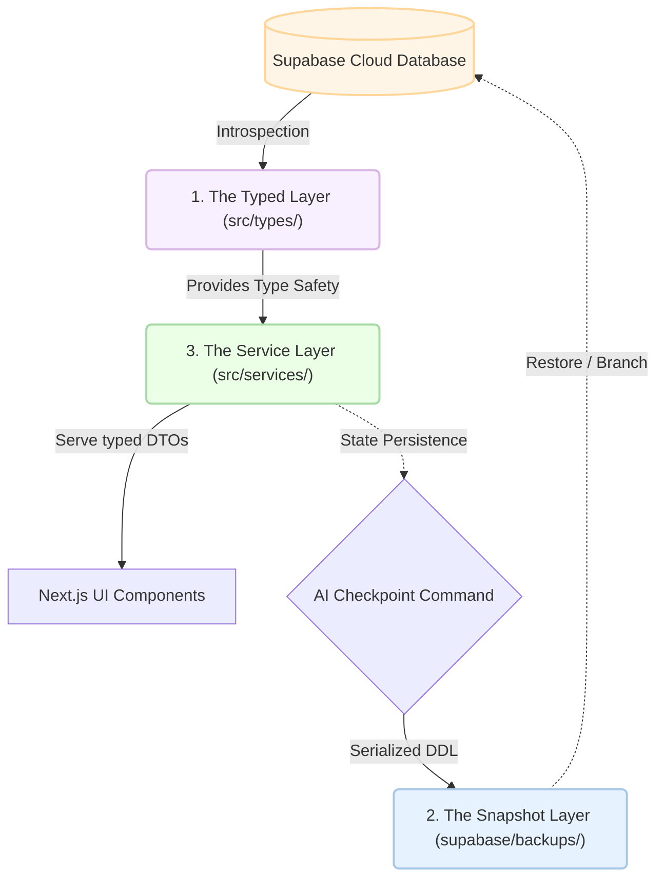

# The DannFlow "Holy Trinity" Architecture

DannFlow follows a strict **Separation of Concerns** model designed to maximize AI-human collaboration and maintain high system velocity.

### 🏗️ Architectural Pattern

---

### 1. The Typed Layer (`src/types/`)
- **Software Engineering Concept**: **Schema Mirroring**
- **Definition**: A static representation of the dynamic database schema.
- **Role**: This layer acts as the "Eyes" of the AI. By running `npm run update-types`, the AI is granted full introspection into the database's foreign keys, enums, and row-level security (RLS) constraints.

### 2. The Snapshot Layer (`supabase/backups/`)
- **Software Engineering Concept**: **Version-Controlled State**
- **Definition**: Timestamped DDL (Data Definition Language) exports.
- **Role**: This is our "Blueprint" for disaster recovery and environment parity. This file ensures that your database state is tracked along with your code, allowing for atomic rollbacks.

### 3. The Service Layer (`src/services/`)
- **Software Engineering Concept**: **Domain Logic Isolation**
- **Definition**: Pure asynchronous functions that encapsulate data fetching and business rules.
- **Role**: This is the "Action" layer. UI components must remain "dumb" and only focus on presentation. All logic, from row filtering for RLS to complex aggregations, must happen here to ensure maintainability and testability.

### 🛡️ Security Protocol (RLS Awareness)
Every developer and agent working on DannFlow must adhere to the RLS Constraint: **Queries must always include current user context**. By default, services are designed to fail-safe unless an explicit `userId` filter is provided.
